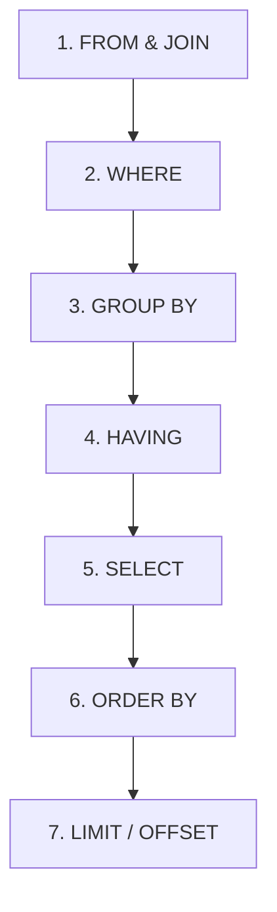

# SDET Learning Playground: Lesson 5 - SQL Database Validation for QA

>>> DANI VERZIOJA: Ez a sor a konfliktus teszteléséhez készült! (Dani modositasa) <<<
In modern automation (e.g. REST Assured, Selenide, Playwright E2E), testing isn't just about the UI or API response. You frequently need to query the database directly (via JDBC/SQL) to verify that transactions or actions were correctly persisted.

This guide explains the most critical SQL concepts for QA Engineers, breaks down common interview traps, and provides practical validation queries.

---

## 1. The Core Trap: SQL Order of Execution

The single most common mistake QA engineers make is writing SQL queries based on how they are **written** rather than how they are **executed** by the database engine.

### How a Query is WRITTEN (Syntax Order):
1. `SELECT`
2. `FROM` & `JOIN`
3. `WHERE`
4. `GROUP BY`
5. `HAVING`
6. `ORDER BY`

### How the Database Actually RUNS it (Execution Order):


### Why this Order explains the Traps:
*   **The Trap (Question 3):** Why can't we do `WHERE COUNT(id) > 1`?
    *   **The Reason:** The `WHERE` clause runs **before** the rows are grouped by `GROUP BY`. At that stage, the database hasn't counted anything yet! 
    *   **The Solution:** You must use `HAVING COUNT(id) > 1` because `HAVING` runs **after** the grouping has completed, when counts and sums are finally calculated.
*   **Aliasing Trap:** You cannot use column aliases created in `SELECT` inside your `WHERE` clause, because `WHERE` executes *before* `SELECT` has assigned the aliases!

---

## 2. Joins Made Visual

When running automation, you often need to fetch fields distributed across multiple tables.

Consider two tables: **`users`** and **`orders`**.

```
    USERS Table                ORDERS Table
+----+----------+         +----+---------+--------+
| id | name     |         | id | user_id | total  |
+----+----------+         +----+---------+--------+
|  1 | Daniel   |         | 10 |    1    |  99.99 |
|  2 | Vojtěch  |         | 20 |    1    |  49.99 |
|  3 | Kyle     |         | 30 |   NULL  |  15.00 |  <-- Guest order
+----+----------+         +----+---------+--------+
```

### A. INNER JOIN (The Default)
*   **Rule:** Returns only rows where there is a match in **BOTH** tables.
*   **Query:**
    ```sql
    SELECT users.name, orders.total 
    FROM users 
    INNER JOIN orders ON users.id = orders.user_id;
    ```
*   **Result:** Only Daniel (id 1) has matching order records.
    ```
    +--------+--------+
    | name   | total  |
    +--------+--------+
    | Daniel |  99.99 |
    | Daniel |  49.99 |
    +--------+--------+
    ```
    *(Vojtěch, Kyle, and the guest order are excluded because they don't have matches on both sides).*

### B. LEFT JOIN (Left Outer Join)
*   **Rule:** Returns **ALL** rows from the Left table (`users`), plus matching rows from the Right table (`orders`). If no match, it returns `NULL`.
*   **Query:**
    ```sql
    SELECT users.name, orders.total 
    FROM users 
    LEFT JOIN orders ON users.id = orders.user_id;
    ```
*   **Result:**
    ```
    +---------+--------+
    | name    | total  |
    +---------+--------+
    | Daniel  |  99.99 |
    | Daniel  |  49.99 |
    | Vojtěch |  NULL  |  <-- No orders found, returns NULL
    | Kyle    |  NULL  |  <-- No orders found, returns NULL
    +---------+--------+
    ```

---

## 3. High-Value QA Validation Queries (Study & Copy)

Here are three real-world SQL patterns frequently used to validate system states in automated test runs:

### Pattern A: Duplicate Check Validation
*   **Goal:** Assert that an API signup did not accidentally create duplicate user entries under the same email.
*   **Query:**
    ```sql
    SELECT email, COUNT(id) AS email_count
    FROM users
    GROUP BY email
    HAVING COUNT(id) > 1;
    ```
*   **Line-by-Line Logic:**
    1.  `FROM users`: Look inside the users table.
    2.  `GROUP BY email`: Combine all rows that share the same email address.
    3.  `COUNT(id)`: Count how many user IDs are associated with each grouped email.
    4.  `HAVING COUNT(id) > 1`: Only return groups where the count is higher than 1 (meaning duplicates exist!).
    5.  **QA Assertion:** In your test framework (e.g. JUnit or Playwright assertion), assert that the returned row-count from this query is **exactly 0**.

### Pattern B: API vs DB Integrations (Total Sales Count)
*   **Goal:** Verify that a user's total purchases value matches what the frontend is claiming.
*   **Query:**
    ```sql
    SELECT users.id, users.name, SUM(orders.total) AS total_spent
    FROM users
    INNER JOIN orders ON users.id = orders.user_id
    WHERE users.status = 'active'
    GROUP BY users.id, users.name
    ORDER BY total_spent DESC;
    ```
*   **Line-by-Line Logic:**
    1.  `FROM users INNER JOIN orders...`: Join the tables together.
    2.  `WHERE users.status = 'active'`: Filter out inactive users *before* aggregating.
    3.  `GROUP BY users.id, users.name`: Group the orders by each user ID and name.
    4.  `SUM(orders.total)`: Add up all order totals for each unique user.
    5.  `ORDER BY total_spent DESC`: Sort so the highest spending user shows at the top.

### Pattern C: Orphaned Data Check (Negative Testing)
*   **Goal:** Ensure that deleting a user account also deleted (or correctly anonymized) their associated orders, leaving no "orphan" rows in the DB.
*   **Query:**
    ```sql
    SELECT orders.id, orders.total
    FROM orders
    LEFT JOIN users ON orders.user_id = users.id
    WHERE users.id IS NULL AND orders.user_id IS NOT NULL;
    ```
*   **Line-by-Line Logic:**
    1.  `FROM orders LEFT JOIN users...`: Join orders to users, preserving all orders even if their user is missing.
    2.  `WHERE users.id IS NULL`: Look specifically for orders where the associated user does not exist in the users table!
    3.  `AND orders.user_id IS NOT NULL`: Exclude orders that were explicitly designed as anonymous guest orders.
    4.  **QA Assertion:** The result of this query must be empty. If any row is returned, you have successfully found a database integrity/leak bug!
