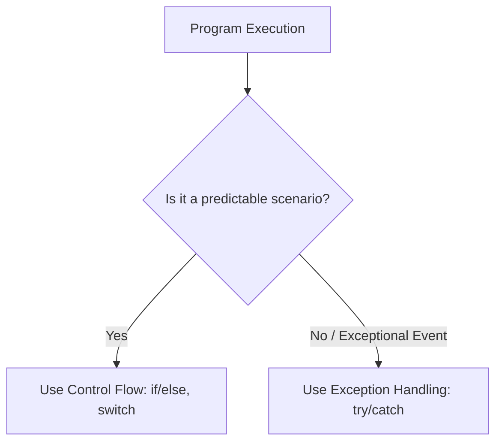

# 🎓 Senior QA Automation Interview Cheat Sheet
## Core Concepts: APIs, Java, Abstraction, and Lifecycles

This guide breaks down key technical questions that frequently trip up candidates in Senior/Lead QA Automation interviews.

---

## 🌐 1. HTTP Idempotency (Why POST is Not Idempotent)

### What is Idempotency?
An HTTP method is **idempotent** if making the same request multiple times has the **exact same side effects on the server** as making it once. The server state remains identical after request #1 as it does after request #10.

### Comparison of Methods:

| HTTP Method | Idempotent? | Why? |
| :--- | :--- | :--- |
| **GET** | **Yes** | It only reads data. Making 100 GET requests does not modify anything on the database. |
| **PUT** | **Yes** | It replaces/updates a resource. If you send a request to update an account balance to `500`, executing it 5 times leaves the balance at `500`. |
| **DELETE** | **Yes** | The first DELETE request removes the resource. Subsequent DELETE requests will return `404 Not Found`, but the *server state* (the resource is gone) remains unchanged. |
| **POST** | ❌ **No** | **POST is used to create resources.** If you submit the same POST request 5 times, the server will create 5 distinct resources (e.g., 5 duplicate bank accounts), modifying the database state each time. |

---

## 💻 2. Control Flow vs. Exception Handling

Understanding when to guide code execution using logical structures versus error handling is key to writing clean automation.



### The Difference:
1. **Control Flow (`if/else`, loops, `switch`):**
   * Used for **expected, predictable, and normal** business decisions.
   * *Example:* "If the language toggle is 'EN', click the English button, else click the Hungarian button."
2. **Exception Handling (`try/catch/finally`):**
   * Used only for **unexpected, exceptional events** that disrupt the normal flow of the program at runtime (typically out of your direct control).
   * *Example:* "Try to read a configuration file. If the file has been physically deleted or database network connection times out, catch the error so the test runner doesn't crash silently."

### ⚠️ The Anti-Pattern: "Using Exceptions for Flow Control"
Writing code that intentionally throws exceptions to guide standard execution paths is a major anti-pattern.
* **Why it's bad:**
  1. **Performance Overhead:** Instantiating an Exception object forces the Java Virtual Machine (JVM) to capture the entire call stack trace, which is extremely CPU-expensive.
  2. **Readability:** It makes code harder to follow, hide bugs, and breaks standard clean code principles.
* *Example (Bad):* Using `try { driver.findElement(...).click(); } catch (NoSuchElementException e) { doSomethingElse(); }` instead of checking if the element is present first.

---

## ☕ 3. Java Method Signature

### What is a Method Signature?
A method signature is the **unique identifier** the Java compiler uses to distinguish methods from one another. 

A Java Method Signature consists of:
1. **The Method Name**
2. **The Parameter List** (the number of parameters, their types, and the order they are in).

```java
public void login(String username, String password)
// Signature: login(String, String)
```

### 🚨 What is NOT Part of the Method Signature?
Interviewers love to ask this to catch you off guard. The following are **NOT** part of the signature:
* **Return Type** (e.g., `void`, `int`, `String`)
* **Access Modifiers** (e.g., `public`, `private`, `protected`)
* **Throws Clauses** (e.g., `throws Exception`)

### Why does it matter? (Method Overloading)
Java allows you to define multiple methods with the same name, as long as they have **different signatures** (i.e., different parameter lists). This is called Method Overloading.

```java
// Overloaded Methods (Valid because signatures are different)
public void fillForm(String name) // Signature: fillForm(String)
public void fillForm(String name, int age) // Signature: fillForm(String, int)
```

---

## 🏗️ 4. Abstraction Layers in an Automation Framework

A senior-level automation framework separates concerns into logical layers. This prevents UI updates or database changes from breaking your actual tests.

```
┌────────────────────────────────────────────────────────┐
│                      TEST LAYER                        │  <-- Clean business scenarios
│       (AssertJ Soft Assertions, JUnit tests)            │      (No locators, no URL paths)
└───────────────────────────┬────────────────────────────┘
                            ▼
┌────────────────────────────────────────────────────────┐
│                   ABSTRACTION LAYER                    │  <-- Page Object Model (POM)
│       (Pages, Locators, action wrappers)               │      (Encapsulates selectors & actions)
└───────────────────────────┬────────────────────────────┘
                            ▼
┌────────────────────────────────────────────────────────┐
│                   CORE / INFRA LAYER                   │  <-- Framework Engine
│      (Selenide configs, JDBC Database connections)     │      (Driver lifecycle, DB managers)
└────────────────────────────────────────────────────────┘
```

1. **Test Layer (`hu.testacademy.ui` / `hu.testacademy.api`):**
   * Contains the executable test scripts and high-level steps.
   * Should contain **no selectors** (like `#submit-btn`) and **no API endpoints** (like `/accounts`).
   * Deals only with business logic and assertions.
2. **Abstraction Layer (Page Object Model / API Client Objects):**
   * Acts as a translation layer.
   * Maps UI pages to Java classes (e.g., [`HomePage.java`](file:///c:/Users/Daniel/Projects/testacademy.hu/qa-automation/src/test/java/hu/testacademy/ui/pages/HomePage.java)).
   * Exposes methods like `login(user, pass)` and hides Selenide locators (`$("#username")`) from the test layer.
3. **Core / Infrastructure Layer:**
   * Handles the setup of test tools, environment config, browser lifecycles, and database managers ([`DatabaseManager.java`](file:///c:/Users/Daniel/Projects/testacademy.hu/qa-automation/src/test/java/hu/testacademy/db/DatabaseManager.java)).
4. **Data Layer:**
   * Keeps test inputs (JSON schemas, CSV data sources) separated from actual test code.

---

## 🔄 5. BDD Before vs. JUnit BeforeEach

### JUnit `@BeforeEach` (JUnit Jupiter)
* **Scope:** Class-level lifecycle.
* **Execution:** Runs before **every single test method** inside the specific Java class where it is defined.
* **Use case:** Preparing test class fields, opening local HTML file contexts, or resetting class-specific state.

### BDD/Cucumber `@Before` (Cucumber Hook)
* **Scope:** Global Scenario-level lifecycle.
* **Execution:** Runs before **every Cucumber Scenario** that is executed, regardless of which feature file or step definition class it resides in.
* **Use case:** Setting up global database connections, starting/stopping mock servers, or initializing global drivers before executing Gherkin steps.

### Why mixing them causes bugs:
If you mix Cucumber step definitions and JUnit assertions in the same classes, putting a `@BeforeEach` and a Cucumber `@Before` together can result in:
1. **Duplicate Executions:** Resetting databases or spinning up browsers twice, dramatically slowing down execution.
2. **NullPointerExceptions:** The JUnit runner and the Cucumber engine manage state lifecycles differently. Mixing them up can cause helper classes to initialize in the wrong order.
